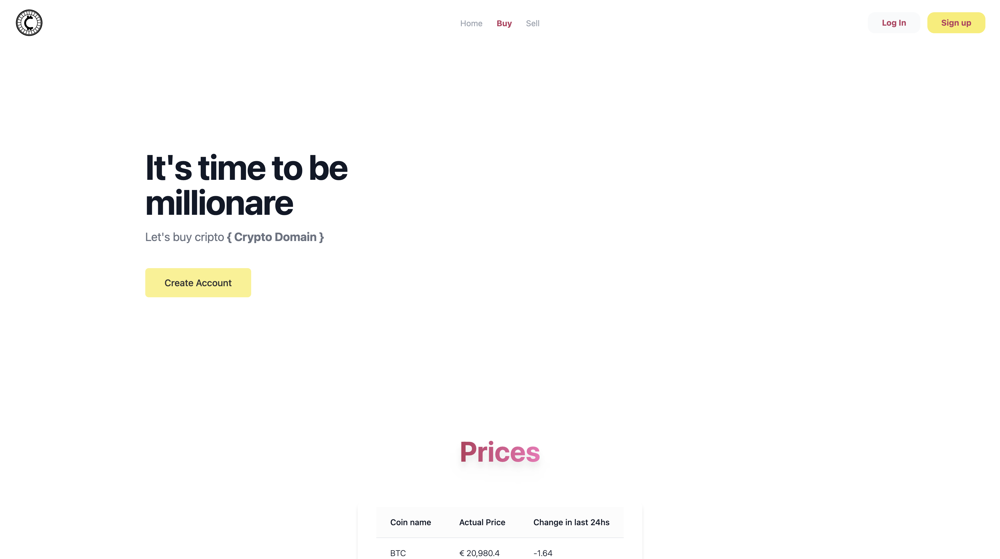
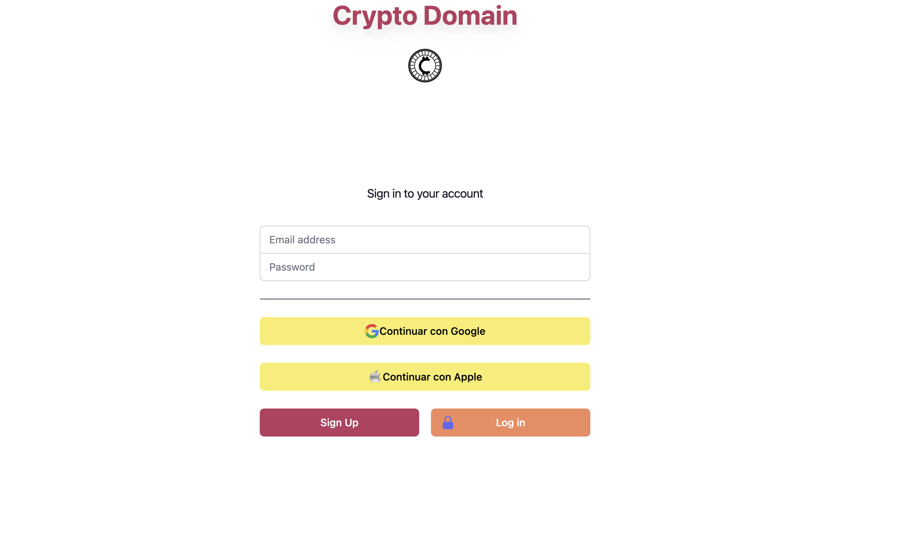
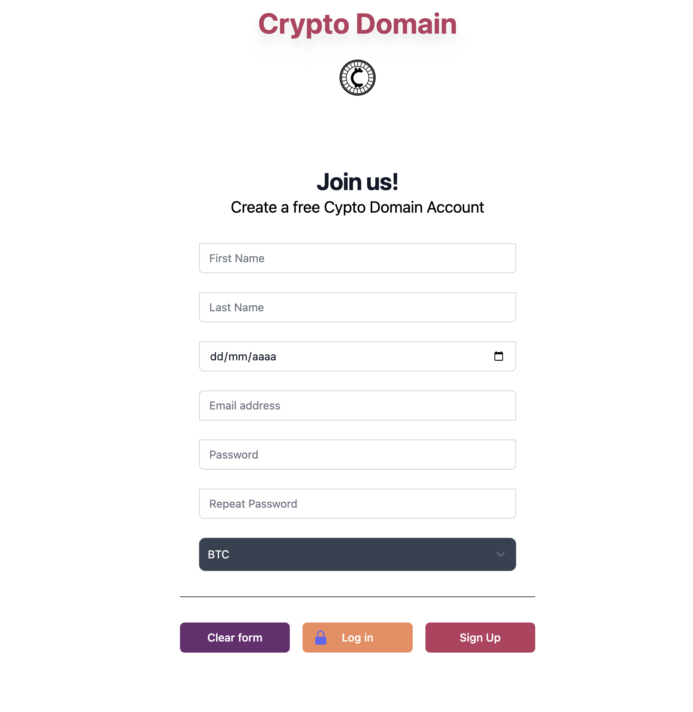
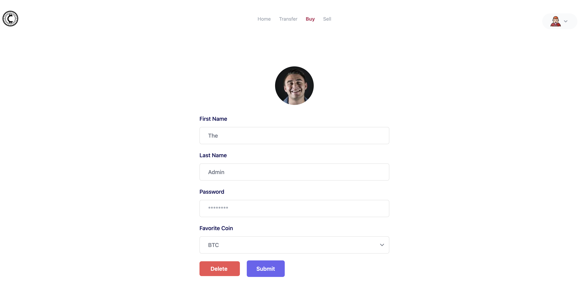
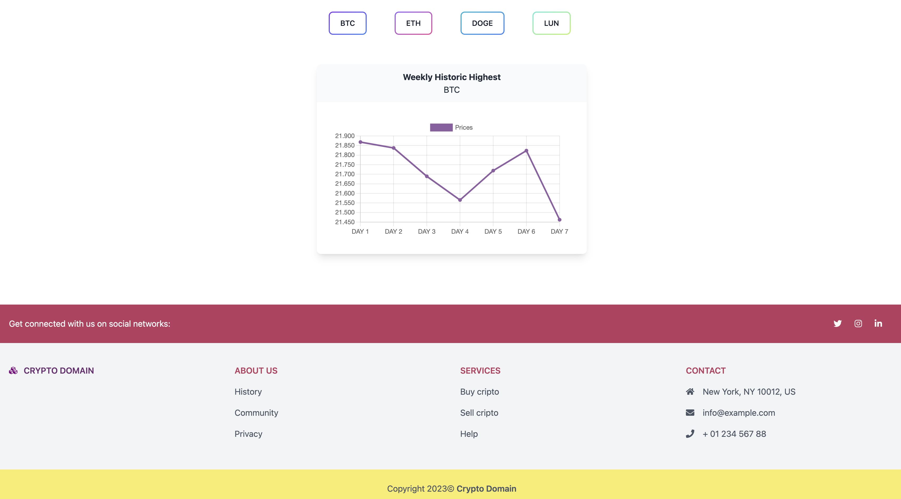
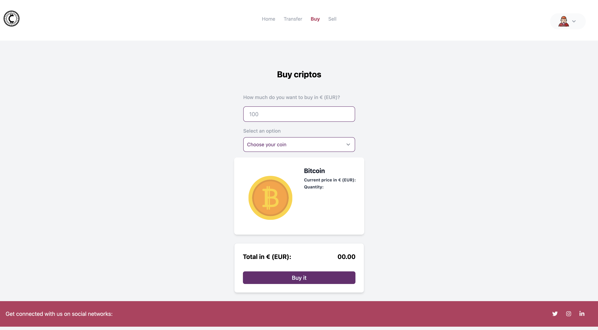
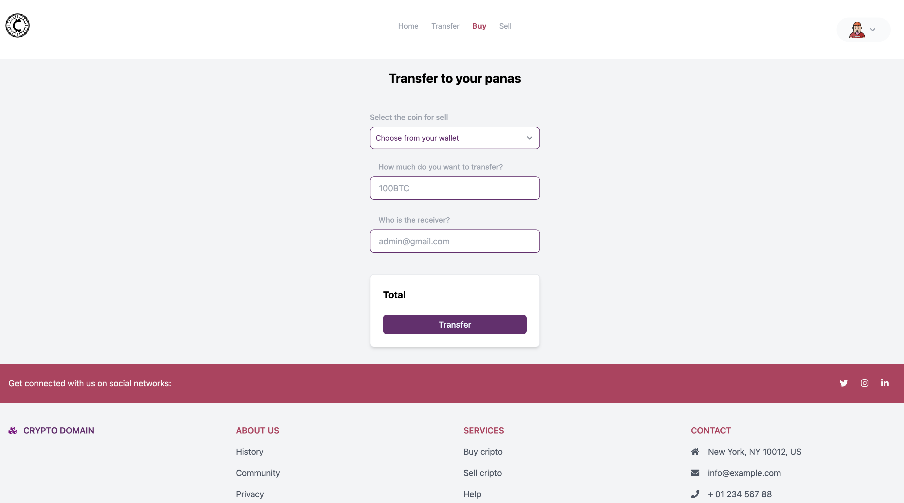
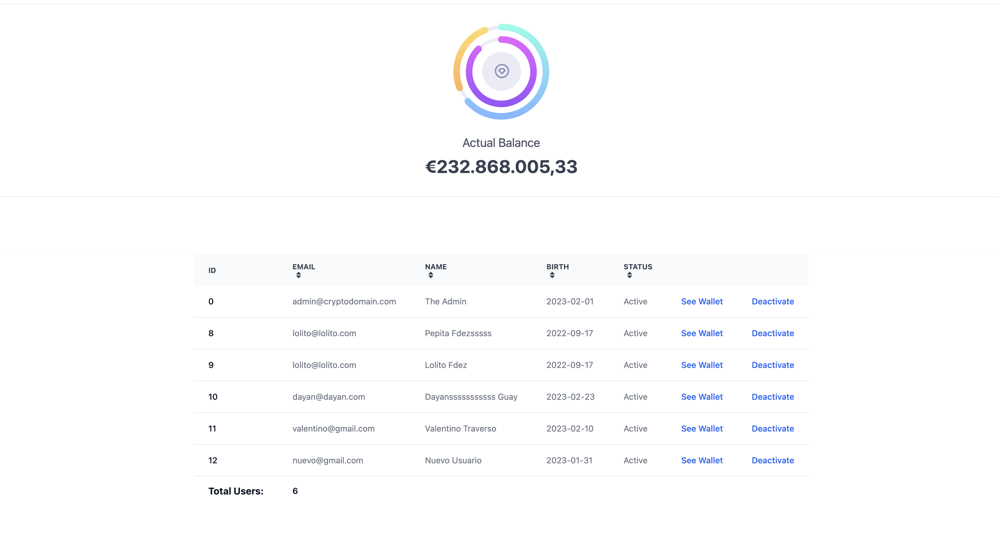

`#html` `#CSS` `#PHP` `#Javascript` `#JSON` `#API` `#MySQL` `#TailWind` `#ChartJS` `#FlowBite` `#Crypto`
# Crypto Domain SSL

The fastest way to buy, sell and transfer criptocoins in the Web 3.0!

Use the app here👇 
[Deploy]()

## Index

- [Previous Settings](#previous-settings)
- [Features](#features)
- [Technologies Used](#technologies-used)
- [Developers](#developers)

## Previous Settings

Here we will teach you config and install our app in you local desktop.

### Settings the path

The file to modify: ./src/controllers/pathControllers.php
We use two differents type of paths:

#### BASE_URL

Which refers to the relative path where your localhost runs.

You need to after it's indicated, and your route its going to see like:

    define ('BASE_URL', 'http://'.$_SERVER['HTTP_HOST'].'/assembler/develop-your-project-in-php');

#### BASE_PATH

Then you must change the absolute path wich it's going to help when differents files requires others.

You need to fullfill after where it's indicated, and it's going to see like this:

    define ('BASE_PATH', $_SERVER['DOCUMENT_ROOT'].'/assembler/develop-your-project-in-php');

🤔Reminder: Both dynamic path text need to be the same.

## Features

- LOG IN / SIGN UP   
This is where you can Log in and Sign up. You must be 18+ and only one email. There can't be 2 users with the same email.

- EDIT INFORMATION   
In this page you can change the value of your First and Last Name. It get stored in the DB.

- WALLET   
In your "Dashboard" you can check how much money you have as well as how much of the different crypto coins you have. There's a dynamic doughnut chart and also a regultar dynamic chart that updates every time you refresh the site.  
You can also add funds.

- BUY   
Here you can buy all the different crypto coins with your funds. There's validations if you don't have enough funds and confirmation popups. 

- SELL   
Here you can sell to the "Admin" all the different crypto currencies you have and funds are added directly into your account.

- TRANSFER   
In this page you can transfer any cryto currency to any user in the website. 

- ADMIN   
This is the page where the admin lives. He can see all wallets, deativate users, total balance of the admin wallet as well as all user details.

 
 
### Technologies used

\* HTML

\* CSS

\* JS

\* Tailwind

\* ChartJS

\* HTTP Requests

\* JSON

\* API

## 📝 Developers

- [**Iuliia Shikhanova**](https://github.com/IuliiaNova)
- [**Albert Gomis**](https://github.com/AlbertGomisM)
- [**Ruben Zafra Traver**](https://github.com/RubenZafra) - *Design Manager*
- [**Valentino Traverso**](https://github.com/valentraverso) - *Project Manager*Features
